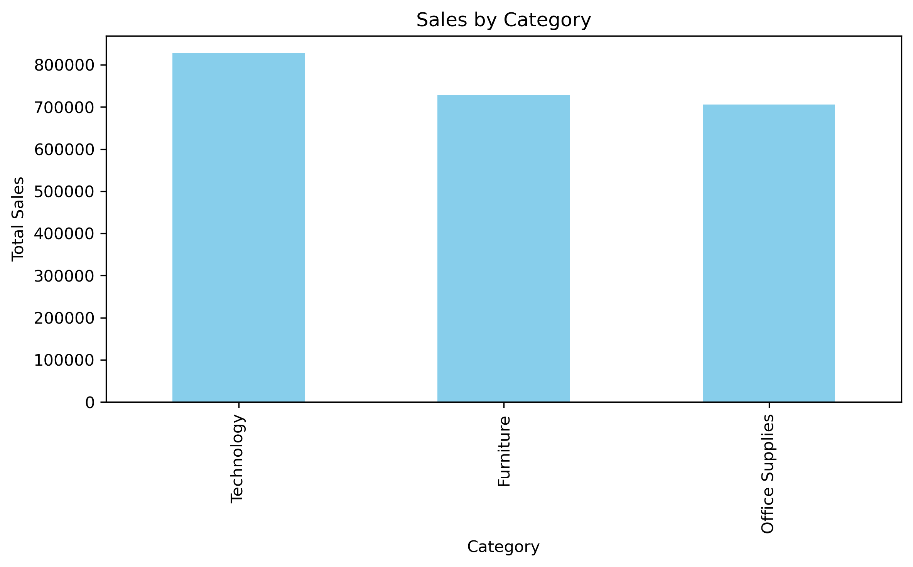
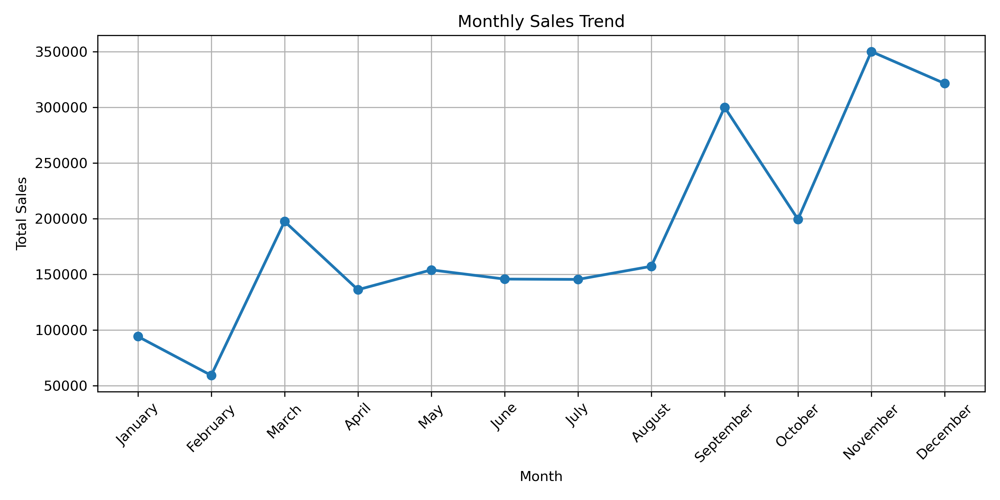
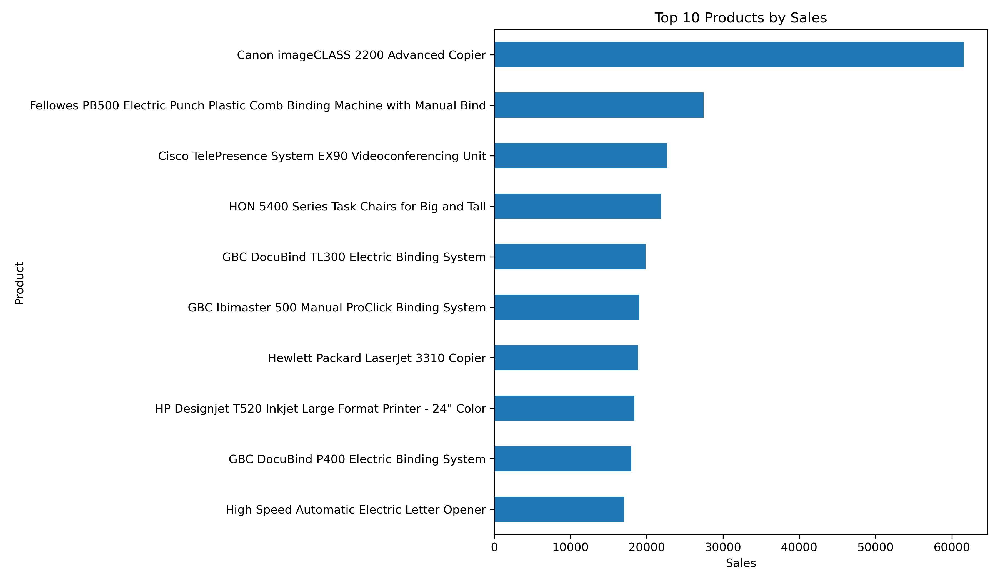
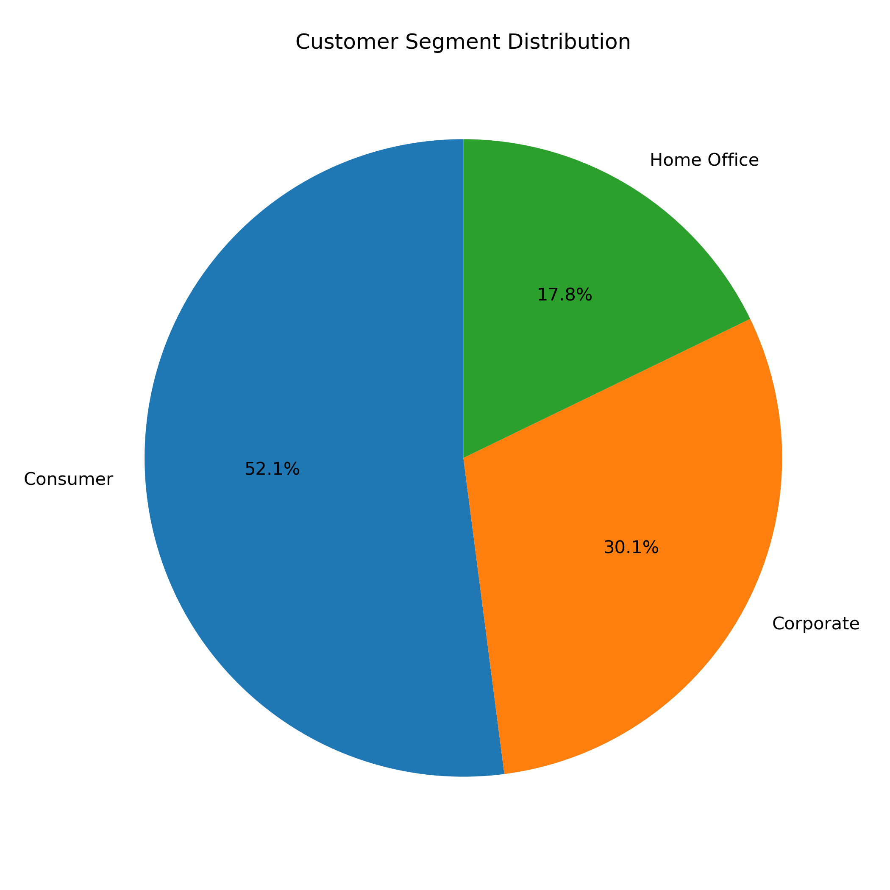

# 📊 Sales Customer Behavior Analysis

An end-to-end data analytics project that analyzes Superstore sales data to uncover customer purchasing behavior, product performance, and regional sales trends using **Python, SQL, Pandas, Matplotlib, and MySQL**.

---

## 📌 Project Overview

The objective of this project is to perform Exploratory Data Analysis (EDA) and SQL-based business analysis on retail sales data to identify meaningful insights that can support business decision-making.

The project demonstrates the complete analytics workflow:

- Data Cleaning
- Data Validation
- Exploratory Data Analysis (EDA)
- Data Visualization
- SQL Business Analysis
- Advanced SQL Analytics

---

## 🎯 Business Objectives

- Analyze overall sales performance
- Identify top-performing product categories
- Discover high-value customers
- Analyze regional and city-wise sales
- Evaluate shipping methods
- Find top-selling products
- Perform customer segmentation analysis
- Demonstrate advanced SQL analytical techniques

---

# 🛠 Tech Stack

| Tool | Purpose |
|------|---------|
| Python | Data Analysis |
| Pandas | Data Cleaning & Manipulation |
| NumPy | Numerical Analysis |
| Matplotlib | Data Visualization |
| SQL (MySQL) | Business Analysis |
| Jupyter Notebook | Analysis Environment |
| Git & GitHub | Version Control |

---

# 📂 Project Structure

```
sales-customer-behavior-analysis
│
├── data
│   ├── train.csv
│   └── cleaned_sales_data.csv
│
├── images
│   ├── sales_by_category.png
│   ├── sales_by_region.png
│   ├── customer_segment_distribution.png
│   ├── monthly_sales_trend.png
│   ├── yearly_sales.png
│   ├── top_cities.png
│   ├── top_products.png
│   ├── top_customers.png
│   ├── ship_mode_sales.png
│   └── subcategory_sales.png
│
├── notebooks
│   └── Sales_Customer_Behavior_Analysis.ipynb
│
├── sql
│   └── sales_analysis.sql
│
├── requirements.txt
└── README.md
```

---

# 📊 Exploratory Data Analysis

The following analyses were performed using Python:

- Total Sales
- Average Sales
- Sales by Category
- Sales by Region
- Sales by Customer Segment
- Top 10 States
- Monthly Sales Trend
- Yearly Sales
- Top Cities
- Top Products
- Top Customers
- Ship Mode Analysis

---

# 🗄 SQL Analysis

The SQL project contains 30+ business queries covering:

### Data Validation

- Total Records
- Missing Values
- Duplicate Orders

### Business Analysis

- Total Sales
- Average Sales
- Minimum & Maximum Sales
- Sales by Category
- Sales by Region
- Sales by Segment
- Top States
- Top Cities
- Top Customers
- Top Products
- Ship Mode Analysis

### Intermediate SQL

- DISTINCT
- GROUP BY
- HAVING
- CASE WHEN
- Aggregate Functions

### Advanced SQL

- RANK()
- DENSE_RANK()
- ROW_NUMBER()
- Window Functions
- Running Total
- Common Table Expressions (CTE)

---

# 📈 Key Business Insights

- Technology generated the highest sales.
- The West region contributed the highest revenue.
- Consumer customers generated the highest overall sales.
- California was the highest revenue-generating state.
- Standard Class was the most frequently used shipping mode.
- A small number of customers contributed significantly to total revenue.

---

# 📷 Sample Visualizations

### Sales by Category



---

### Monthly Sales Trend



---

### Top Products



---

### Customer Segments



---

# 🚀 How to Run

### Clone Repository

```bash
git clone https://github.com/Janhavi0410/sales-customer-behavior-analysis.git
```

### Install Dependencies

```bash
pip install -r requirements.txt
```

### Launch Notebook

```bash
jupyter notebook
```

Open:

```
Sales_Customer_Behavior_Analysis.ipynb
```

---

# 💡 Skills Demonstrated

- Data Cleaning
- Exploratory Data Analysis (EDA)
- Data Visualization
- Business Analytics
- SQL Query Writing
- Window Functions
- Common Table Expressions (CTE)
- Statistical Analysis
- Data Storytelling
- Git & GitHub

---

# 👩‍💻 Author

**Janhavi Rewale**

- LinkedIn: https://www.linkedin.com/in/janhavirewale/
- GitHub: https://github.com/Janhavi0410

---

⭐ If you found this project useful, consider giving it a star.
